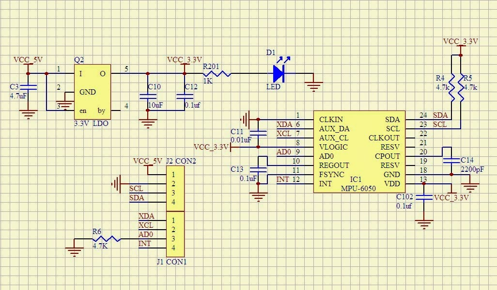

# Pedômetro

Pedômetro é um instrumento que conta o número de passadas de uma pessoa. Existem diferentes maneiras para se construir um, de acordo com o sensor. Podem ser usados contatos na sola, sensores piezoelétricos, entre outros. Neste projeto será usado um acelerômetro de três eixos.

Trabalho desenvolvido para a disciplina de Sistemas Embarcados II do curso de bacharelado em Engenharia de Computação pela Universidade Federal do Espírito Santo.

# Comando

unset PYTHONHOME && unset PYTHONPATH && export PYTHONHOME=$(pyenv root)/versions/3.8.19

## Esquemático



This is the 1th version of pedometro. It uses direct access to register of the EFM32GG990F1024 microcontroller on the EFM32STK3700 board.

It is possible to use the Gecko SDK Library, which includes a HAL Library for GPIO. For didactic reasons and to avoid the restrictions imposed by the license, the direct access to registers is used in this project.

The architecture of the software is shown below.

```
+------------------------------------------------------+
|                     Application                      |
+------------------------------------------------------+
|                      Hardware                        |
+------------------------------------------------------+
```

To access the registers, it is necessary to know their addresses and fields. These information can be found in the data sheet and other documents from the manufacturer. The manufacturer (Silicon Labs) provides a CMSIS compatible header files in the *platform* folder of the Gecko SDK Library.

The *platform* folder has the following sub-folders of interest: *Device* and *CMSIS*. In the *Device/SiliconLabs/EFM32GG/Include/* folder there is a header file named *emf32gg990f1024.h*, which includes the definition of all registers of the microcontroller. One has to be careful because it includes a lot of other header files (*emf32gg_*.h*). It is possible to include the *emf32gg990f1024.h* file directly in the code, like below.

```c
#include <emf32gg990f1024.h>
```

But a better alternative is to use a generic include and define which microcontroller is used as a parameter in the command line (actually a definition of a preprocessor symbol).

```c
#include "em_device.h"
```

The command line must then include the *-DEMF32GG990F1024* parameter. To use this alternative one, has to copy the *em_device.h* to the project folder and used quote marks (“”) instead of angle brackets (<>) in the include line.

Instead of using symbols like *0x2* to access the bit to control the *LED1*, it is better to use a symbol LED1 as below.

```c
#define LED1 0x2
```

To define it, a common idiom is to use a BIT macro defined as below (the parenthesis are recommended to avoid surprises).

```c
#define BIT(N) (1<<(N))
```   

The symbols to access the LEDs in the GPIO Port E registers can then be defined as

```c
#define LED1 BIT(2)
#define LED2 BIT(3)
```

To use the GPIO Port, where the LEDs are attached, it is necessary to:

-   Enable clock for peripherals
-   Enable clock for GPIO
-   Configure pins as outputs
-   Set them to the desired values

To enable clock for peripherals, the *HFPERCLKEN* bit in the *HFPERCLKDIV* register must be set. To enable clock for the GPIO, the *GPIO* bit of the *HFPERCLKNE0* register must be set. Both of them are done by or'ing the mask already defined in the header files to the registers.

```c
/* Enable Clock for GPIO */
CMU->HFPERCLKDIV |= CMU_HFPERCLKDIV_HFPERCLKEN; // Enable HFPERCLK
CMU->HFPERCLKEN0 |= CMU_HFPERCLKEN0_GPIO; // Enable HFPERCKL for GPIO
```

    
To easy access to the register for GPIO Port E, a constant is defined, that points to the memory region containing the GPIO E registers.

```c
GPIO_P_TypeDef * const GPIOE = &(GPIO->P[4]); // GPIOE
```

To configure the pins as outputs one has to set the mode fields in the MODE registers. There are two MODE registers: *MODEL* to configure pins 0 to 7 and *MODEH*, for pins 8 to 15. To drive the LEDs, the fields must be set to Push-Pull configuration, but just or a binary value is not enough. The field must be cleared (set to 0) before.

```c
/* Configure Pins in GPIOE */
GPIOE->MODEL &= ~(_GPIO_P_MODEL_MODE2_MASK|_GPIO_P_MODEL_MODE3_MASK); 		// Clear bits
GPIOE->MODEL |= (GPIO_P_MODEL_MODE2_PUSHPULL|GPIO_P_MODEL_MODE3_PUSHPULL); 	// Set bits
```

This can be done in one step, with a longer command.

```c
GPIOE->MODEL = (GPIOE->MODEL&~(_GPIO_P_MODEL_MODE2_MASK|_GPIO_P_MODEL_MODE3_MASK))
                |(GPIO_P_MODEL_MODE2_PUSHPULL|GPIO_P_MODEL_MODE3_PUSHPULL);
```

In the code, this is under conditional compiling pattern. #if 1..#else...#endif. Changing 1 to 0, 
the code under the else is compiled.

Finally, to set the desired value, one can or a value with a bit 1 in the desired position and all other bits set to 0.

```c
GPIOE->DOUT |= LED1;
```

To clear it, one must AND a value with a bit 0 in the desired position and all other bit set to 1

```c
GPIOE->DOUT &= ~LED1;
```

To toggle a bin, one can XOR a value with a bit 1 in the desired position (and other bits set to 0).

```c
GPIOE->DOUT ^= LED1;
```

In the code, there are two blinking options by using conditional compiling.

	Alternate:         00 0* ** *0 00 ....
    Both:              00 ** 00 .....