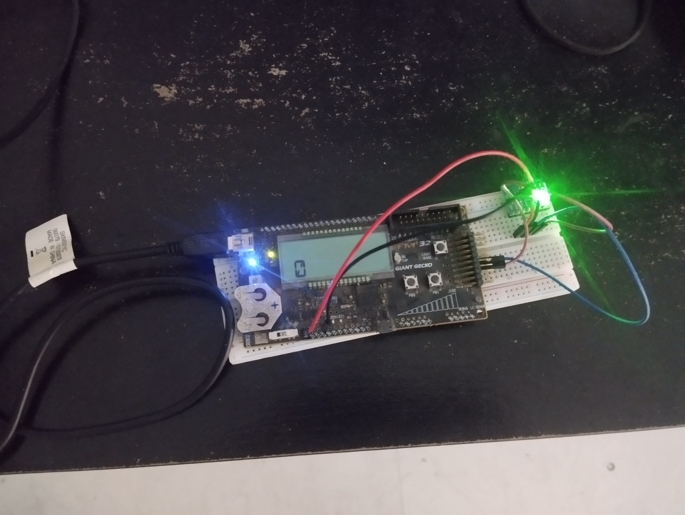
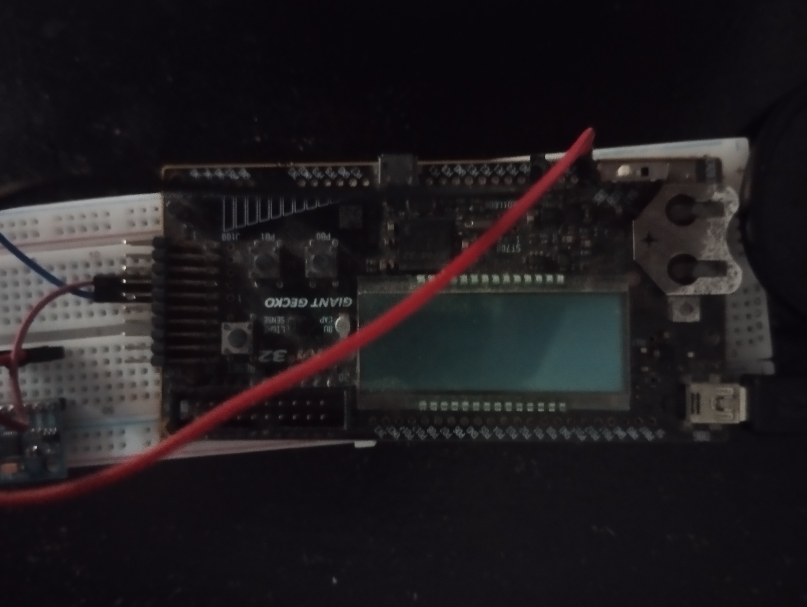
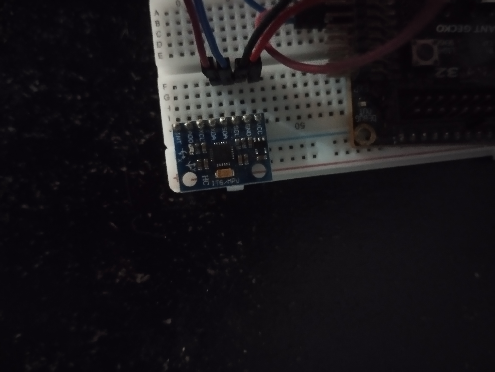

    
  <a href="https://github.com/mateus-sartorio/pedometer"><kbd>🔵 GitHub</kbd></a>

# 🏃 Pedometer

A pedometer is an instrument that counts a person's steps. There are different ways to build one, depending on the sensor. Contact sensors on the sole, piezoelectric sensors, among others, can be used. In this project, a three-axis MPU 6050 accelerometer will be used.

This work was developed for the Embedded Systems II course in the Bachelor's degree in Computer Engineering at the Federal University of Espírito Santo.

 

  

 
 

  
  

 
 

## ⚡ Circuit schematics

Below is the schematics of how the MPU 6050 sould be connected.

 

## ⚠️ Limitations and known bugs

- The I2C read and write implementations generally work as expected—register values are correctly read, and configuration registers in the MPU 6050 are updated successfully. However, there are instances where the main loop of the state machine within these routines enters an invalid state, causing the application to get stuck in the I2C read or write process.

- The logic designed for step counting using a moving average filter is not functioning as intended. The calculated acceleration variation never surpasses the threshold required to count a step. This issue might be related to the application halting when the I2C read routines get stuck.

 

## 🧠 What I learned with this project and the Embedded Systems course as a whole

- I learned about Hardware Abstraction Layers (HALs) and how it allows developers to create interfaces with varying levels of abstraction in embedded systems. I understood that higher levels of abstractions come as tradeoffs: that more abstraction in HALs can make development easier and more versatile for multiple microcontrollers, but may come at the cost of performance and more specialized knowledge of a specific board or development kit.

- I worked with implementations of HAL modules for the EFM32GG microcontroller, including GPIO, LED, LCD, and I2C, and even implemented some of my own HALs.

- I developed techniques for managing embedded software, particularly using interrupts to reduce power consumption when the processor is not heavily used.

- I gained knowledge in multitasking within embedded systems, understanding how breaking down complex applications into smaller, single-responsibility tasks can simplify development.

- I Learned about serial communication protocols, with a focus on the I2C protocol, which I implemented in my project. I also explored making communication more power-efficient and non-blocking through the use of interrupts.

- I Gained experience using GDB and other debuggers to analyze code running on microcontrollers, enhancing my debugging skills in embedded system environments.

 

## ⚖️ License:

Copyright Universidade Federal do Espirito Santo (UFES)

This program is free software: you can redistribute it and/or modify it under the terms of the GNU General Public License as published by the Free Software Foundation, either version 3 of the License, or (at your option) any later version.

This program is distributed in the hope that it will be useful, but WITHOUT ANY WARRANTY; without even the implied warranty of MERCHANTABILITY or FITNESS FOR A PARTICULAR PURPOSE.  See the GNU General Public License for more details.

You should have received a copy of the GNU General Public License along with this program.  If not, see <https://www.gnu.org/licenses/>.

This program is released under license GNU GPL v3+ license.

## 🛟 Support:

Please report any issues with the application at [github.com/mateus-sartorio/pedometer](https://github.com/mateus-sartorio/pedometer).
